<p align="center">
  
</p>

# claude-pricing

> Hermann Simon showed pricing is the highest-leverage lever in B2B —
> and the one most operators give the least attention. A 1% price
> improvement drives ~11% profit improvement.

The full **JMC Pricing Surgery course** as a skill pack — 11
sub-skills, 2 specialist agents, 3 deterministic Python scripts,
brand-config-driven so it sounds like *you*, not Jay, not ChatGPT.

No LLM calls inside the skill itself. No paid APIs. No vendor
lock-in. Bring your own model; bring your own data.

[](LICENSE)
[](https://github.com/cmj-hub/claude-pricing)


<p align="center">
  
</p>

## What it does

```mermaid
graph TB
    A["/pricing"] --> B{Kickoff: state check}
    B -->|First time| C[Onboarding<br/>brand-config + SOUL]
    B -->|Have config| D[Diagnostic / Audit / Tribunal]
    C --> D
    D --> E[Pocket-price<br/>waterfall script]
    E --> F[Decoy validator<br/>script]
    F --> G[Reference frames<br/>+ contrast set]
    G --> H[Quarterly review<br/>+ renewals]
    H --> D

    style C fill:#1a1a2e,stroke:#00d4ff
    style E fill:#1a1a2e,stroke:#cc4714
    style F fill:#1a1a2e,stroke:#cc4714
    style H fill:#1a1a2e,stroke:#00d4ff
```



## The 11 sub-skills

| Sub-skill | What it does |
|---|---|
| `pricing-kickoff` | Adaptive router. Detects what's set up (brand-config? PSP? current tiers? WTP data? value-metric? anchor? waterfall? quarterly cadence?) and picks the next-best step |
| `pricing-onboarding` | 10-minute interactive setup → `brand-config.json` + `SOUL.md` at repo root |
| `pricing-diagnostic` | Three-surface diagnostic — WTP distribution, value-metric alignment, packaging-vs-pricing. Outputs triage decision |
| `pricing-audit` | 30-point pricing program audit → 0-100 score + top 3 levers + 90-day remediation order |
| `pricing-tribunal` | High-stakes decision workflow (Hypothesize → Test → Adjudicate → Audit) for material pricing changes |
| `pricing-reference-frames` | Anchor-design engine — picks the strongest plausible frame (inertia / opportunity cost / replacement cost) and applies Prospect Theory loss aversion |
| `pricing-contrast-set` | Three-tier + decoy architecture. Asymmetric dominance, anchor ≥3x target, predicted landing distribution |
| `pricing-pocket-waterfall` | Discount-leak detector. Per-customer + cohort waterfall, top-3 leak ranking, policy recommendations |
| `pricing-value-metric` | Price-unit picker (per-seat / per-call / per-record / per-outcome / hybrid). 4-criterion right-metric rubric + metric-shift case-study reservoir |
| `pricing-quarterly-review` | The operating cadence. Agenda, data pull, verdict format (HOLD / ITERATE / ESCALATE TO TRIBUNAL) |
| `pricing-renewal-discipline` | Renewal motion (90-day notice, value-anchored escalation), expansion triggers, contraction-response playbook |

Plus 2 specialist agents:

- `pricing-reviewer` — scores any pricing page or tier proposal 0-100 with line-by-line failures + surgical rewrites
- `pricing-tribunal-judge` — adjudicates pricing hypotheses against the verdict matrix; produces ROLL OUT / ITERATE / ABANDON

## Real scripts, not pure vibes

| Script | Job |
|---|---|
| `scripts/pocket_price_waterfall.py` | Per-customer + cohort discount-leak calculator. Computes pocket price after every leak step + ranks leaks by total margin impact |
| `scripts/decoy_validator.py` | Three-tier asymmetric-dominance checker. 6-rule rubric → 0-100 score → REBUILD / ITERATE / HEALTHY verdict |
| `scripts/wtp_distribution.py` | Van Westendorp PSM analyzer. Computes the 4 thresholds (PMC / IPP / OPP / PME) + acceptable price range. Supports per-PSP analysis |

Each script is **zero-dependency Python 3.8+**. No `pip install`, no
API keys, no network calls. Calibrated against JMC's review of B2B
pricing engagements + 50+ years of empirical Simon-Kucher research.

## The 3-tier config (operator owns)

```
brand-config.json   ← Your tiers, value metric, customers, discount policy, review cadence
SOUL.md             ← Your voice — phrases used, phrases banned, stories you lean on
AGENTS.md           ← Behavior rules — refuse banned patterns, sign-off discipline, no fabrication
```

The JMC framework is the engine. These three files personalize every
output. **The skill refuses to recommend real pricing without
brand-config + SOUL set up** — generic AI pricing is worse than
none.

## Install

### Claude Code

```bash
/plugin marketplace add cmj-hub/claude-pricing
/plugin install pricing
```

### One-line install (any project)

```bash
curl -fsSL https://raw.githubusercontent.com/cmj-hub/claude-pricing/main/install.sh | bash
```

### Windows

```powershell
iwr https://raw.githubusercontent.com/cmj-hub/claude-pricing/main/install.ps1 -useb | iex
```

## First run

```
> /pricing
```

The kickoff sub-skill detects state. If you're new:

```
[Detected state: brand-config.json missing]

Pricing setup — state check
─────────────────────────────────────────────────────────────────

1. ⬜ brand-config + SOUL set up                ← YOU ARE HERE
2. ⬜ Current tiers documented
3. ⬜ Pain Signal Profile defined
4. ⬜ Willingness-to-pay discovery done
5. ⬜ Value-metric chosen
6. ⬜ Reference anchor set
7. ⬜ Pocket-price waterfall built
8. ⬜ Three-tier contrast set designed
9. ⬜ Quarterly pricing review scheduled

Recommended next step: Step 1 (~10 minutes).
Want to run it now? (y/n)
```

## What this actually replaces

| Role | $/year | What you'd outsource |
|---|---|---|
| Pricing consultant (boutique) | $50K-$200K/engagement | One-off diagnostic + tier rebuild |
| Pricing strategist (FTE) | $180K+ benefits | Continuous pricing-as-discipline |
| Hermann Simon-style firm | $250K-$1M | Full diagnostic + reference architecture |

This skill pack + ~3 hrs/quarter of operator time can do the
diagnostic, three-tier design, pocket-price waterfall, reference-frame
copy, tribunal discipline, and quarterly cadence that a pricing
strategist would otherwise own.

It does **not** replace:
- The customer-development work (you still have to talk to customers)
- The judgment calls (which PSP to optimize for this quarter)
- The political work (getting sales + finance + product aligned)

It **does** replace:
- The framework (Simon + Kahneman + Ariely + Christensen distilled into operating practice)
- The discipline layer (audit + waterfall + tribunal + quarterly review)
- The QA layer (decoy validator + tier-set scorer + tribunal judge)

## The framework in one diagram

```
Diagnose ─→ Anchor ─→ Tier ─→ Discount-policy ─→ Review
   │           │         │           │              │
   │           │         │           │              ▼
   │           │         │           │       Quarterly cadence
   │           │         │           ▼              │
   │           │         │     Pocket waterfall     │
   │           │         ▼           │              │
   │           │   Three-tier        │              │
   │           │   + decoy           │              │
   │           ▼         │           │              │
   │     Reference       │           │              │
   │     frame stack     │           │              │
   ▼           │         │           │              │
WTP +          │         │           │              │
value-metric ──┴─────────┴───────────┴──────────────┘
   │
   ▼
Pain Signal Profile (PSP) ← FOUNDATION
```

Every recommendation this skill produces serves one of those nodes.
If it doesn't, the skill cuts it. The full framework lives in
[`pricing/references/pricing-framework.md`](./pricing/references/pricing-framework.md).

## Banned patterns

The skill refuses to produce these — pushes back with the JMC-shaped
alternative. Full list at
[`pricing/references/pricing-banned-patterns.md`](./pricing/references/pricing-banned-patterns.md):

- Cost-plus pricing
- Competitor-anchored pricing ("we're cheaper than X")
- Open-ended "money-back" guarantees
- "Contact us for pricing" below $30K ACV
- Two-tier or four+-tier pricing
- Per-seat when the value is per-something-else
- Discounting without policy
- Hidden fees / surprise charges
- Mass-raising existing customers to new list price
- Decoy tier without asymmetric dominance

## Plugs into

Companion skill packs (install separately):

- `cmj-hub/claude-psp` — Pain Signal Profile builder
- `cmj-hub/claude-evp` — EVP Generator (Schwartz tiers)
- `cmj-hub/claude-cold-email` — Cold email + outreach craft (sibling pack)
- `cmj-hub/claude-founder-brand` — Founder-led social
- `cmj-hub/claude-operator-pass` — Operator Pass API wrapper (the deterministic execution layer)

## Repo structure

```
claude-pricing/
├── .claude-plugin/plugin.json
├── README.md
├── LICENSE
├── CHANGELOG.md
├── AGENTS.md                          ← Behavior rules
├── SOUL.md                            ← Voice template (operator personalizes)
├── brand-config.example.json          ← Brand config template
├── install.sh
├── install.ps1
├── pricing/                           ← Main orchestrator
│   ├── SKILL.md
│   └── references/
│       ├── pricing-framework.md
│       ├── pricing-banned-patterns.md
│       └── pricing-lineage.md
├── skills/                            ← 11 sub-skills (progressive disclosure)
│   ├── pricing-kickoff/
│   ├── pricing-onboarding/
│   ├── pricing-diagnostic/
│   ├── pricing-audit/
│   ├── pricing-tribunal/
│   ├── pricing-reference-frames/
│   ├── pricing-contrast-set/
│   ├── pricing-pocket-waterfall/
│   ├── pricing-value-metric/
│   ├── pricing-quarterly-review/
│   └── pricing-renewal-discipline/
├── agents/                            ← 2 specialist agents
│   ├── pricing-reviewer.md
│   └── pricing-tribunal-judge.md
└── scripts/                           ← Deterministic Python (no LLM)
    ├── pocket_price_waterfall.py
    ├── decoy_validator.py
    ├── wtp_distribution.py
    ├── validate-skill-frontmatter.py
    └── smoke-test.sh
```

## Course

This skill is the agent-form of the JMC **Pricing Surgery: The
Hermann Simon Discipline** course. The course covers 40 lessons
across diagnostic discipline, reference frames + loss aversion,
value-metric engineering, contrast-set architecture, operating
practice, and the capstone Pricing Decision Tribunal sprint.

→ **[jaymountconsulting.com/learn/courses/pricing-surgery](https://jaymountconsulting.com/learn/courses/pricing-surgery)**

Want it all-access? **[Operator Pass](https://jaymountconsulting.com/operator-pass)**
unlocks every course in The Compounding Engine plus the deterministic
tools API.

## License

MIT. See [LICENSE](./LICENSE).

## About

Built by [Jay Mount Consulting](https://jaymountconsulting.com) as
part of the JMC public-build spine. See
[/build](https://jaymountconsulting.com/build) for what's shipping
this week, [/skills](https://jaymountconsulting.com/skills) for the
rest of the skill packs.
