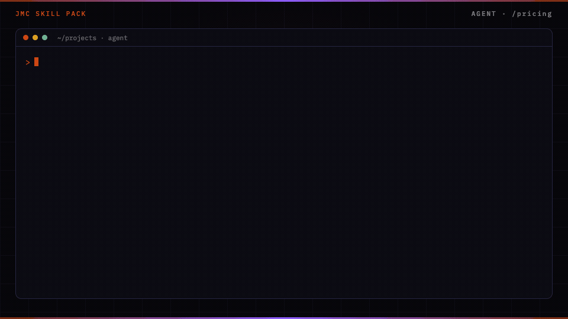

<p align="center">
  
</p>

# Pricing strategy skill for Claude Code

A pricing strategy is how you choose what to charge, what the price is compared with, and where the discount leaks.

## Contents

- What this replaces
- Install
- What you walk out with in 15 minutes
- What this pack will not do
- Is this just "raise prices 15%"?
- Do I need survey data?
- Does this change live prices?
- Free, no signup
- Free, by email
- Companion packs
- License
- Regenerating the artwork


You hold a value metric, a contrast set, and a tribunal. The scorer refuses a price with no metric.

> "Raise prices 15%" is not a diagnosis. The leak is usually after the list price.

Pricing surgery treats price as the highest-leverage B2B lever: diagnose willingness-to-pay, pick the value metric, set a reference frame, build a three-tier contrast set, then plug discount leaks. A 1% price improvement is ~11% profit on typical B2B economics (Simon).

You already know the list price. You may not know the pocket price — what is left after ramp discounts, "strategic" exceptions, annual prepay, implementation credits, and net-60. Hermann Simon spent fifty years on that gap. This pack scores it.

The mechanism is surgical, not theatrical. Willingness-to-pay. Value metric. Reference frame. Three-tier contrast with a real decoy. Pocket-price waterfall. `decoy_validator.py` on the sample healthy set scores **100**. The broken two-tier mixed-unit set scores **10.5**. Python. No LLM. No paid API.

The build guide teaches the framework to a human. This pack teaches the same framework to an agent.

[](https://claude.ai/claude-code)
[](LICENSE)
[](https://github.com/cmj-hub/claude-pricing)
[](https://skills.sh/cmj-hub/claude-pricing)


<p align="center">
  
</p>

## What this replaces

A boutique pricing sprint's diagnostic week — not the political work of getting sales and finance in the same room.

## Install

Two commands. Works in Claude Code, Cursor, Codex, Grok, Copilot, Windsurf, Cline, OpenCode, and the rest of the [skills CLI](https://skills.sh) list.

```bash
npx skills add cmj-hub/claude-pricing --all -g --full-depth
```

```text
/plugin marketplace add cmj-hub/gtm-operator-skills
/plugin install pricing
```

Also: `npm install github:cmj-hub/claude-pricing` then `npx jmc-pricing`. Or `curl -fsSL https://raw.githubusercontent.com/cmj-hub/claude-pricing/main/install.sh | bash`.

## What you walk out with in 15 minutes

Artifact: `examples/tiers-healthy.json`.

```bash
python3 scripts/decoy_validator.py --tiers examples/tiers-healthy.json
python3 scripts/decoy_validator.py --tiers examples/tiers-broken.json
```

Run the decoy validator on the sample three-tier set. Then drop in yours.

## What this pack will not do

It will not change live prices. It will not run a customer survey. It will not sit a tribunal on the first run.

This pack drafts and scores. It will not pick this quarter's PSP, ingest your CRM, or update when Gmail changes the spam window. Those are judgement calls and live data. This pack gives you the instrument and the rubric; you bring the account.

## Is this just "raise prices 15%"?

No. A blanket raise still leaks pocket price. Diagnose willingness-to-pay, the value metric, and the discount stack first. Then cut. Pricing is surgery. Diagnose first. Cut last.

## Do I need survey data?

No for the first loop. The decoy validator runs on a three-tier JSON file. Van Westendorp is in the pack when you have responses. It is not a gate.

## Does this change live prices?

No. It scores and recommends. Shipping the change — grandfathering, sales enablement, the email to the book — is your motion.

## Free, no signup

- **[Pricing Page Lab](https://jaymountconsulting.com/tools/pricing-page-lab)** — the same job as this pack, hosted. No account, no key.
- [Offers & Productized Outcomes framework](https://jaymountconsulting.com/frameworks/offers-productized-outcomes)
- [Calculator Pack](https://jaymountconsulting.com/resources/calculator-pack)

## Free, by email

[**Growth Audit**](https://jaymountconsulting.com/growth-audit) — where your go-to-market stack is leaking, sent to your inbox.

That one does ask for an email, and it enrols you in a short follow-up on the same topic. Unsubscribe whenever.

[**The Friday Signal**](https://jaymountconsulting.com/newsletter/signal) — one free edition a week on building GTM systems that compound. No pitch in it.


## Companion packs

- [claude-psp](https://github.com/cmj-hub/claude-psp) — Ideal customer profile
- [claude-evp](https://github.com/cmj-hub/claude-evp) — Value proposition
- [claude-cold-email](https://github.com/cmj-hub/claude-cold-email) — Cold email
- [claude-founder-brand](https://github.com/cmj-hub/claude-founder-brand) — LinkedIn posts
- [claude-landing-page](https://github.com/cmj-hub/claude-landing-page) — Landing page
- [claude-geo](https://github.com/cmj-hub/claude-geo) — Generative engine optimization
- [claude-sales-offer](https://github.com/cmj-hub/claude-sales-offer) — Sales offer
- [claude-prospect-list](https://github.com/cmj-hub/claude-prospect-list) — Sales prospecting
- [claude-email-sequence](https://github.com/cmj-hub/claude-email-sequence) — Email sequence

## License

MIT. See [LICENSE](./LICENSE).


## Regenerating the artwork

`assets/social-preview.png` and `assets/header.png` are generated from `assets/spec.json` by a vendored renderer — no CI, no shared workflow, no network beyond the webfonts:

```bash
node assets/card.mjs assets/spec.json assets/          # social-preview.png + header.png
npm i playwright-core && node assets/demo.mjs assets/spec.json assets/demo.gif
```
